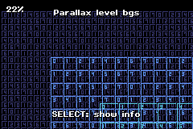
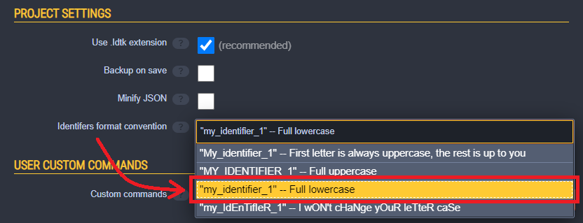
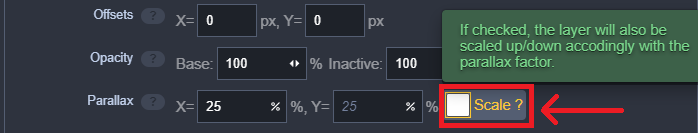

# butano-ldtk

[](https://github.com/copyrat90/butano-ldtk/actions/workflows/build-examples.yml)


[butano-ldtk](https://github.com/copyrat90/butano-ldtk) is a [LDtk](https://ldtk.io/) level importer for the [Butano engine](https://github.com/GValiente/butano).



## Features

* Render LDtk levels as GBA backgrounds with only one line of C++ code.
* Access *almost* all datas in the [LDtk JSON](https://ldtk.io/json) as `constexpr` objects.
   * IntGrids, Entities, Enums, Level fields, ... anything useful is imported.
* Provides [usage examples](examples/) and [API documentation](https://copyrat90.github.io/butano-ldtk).

## Getting started

### Prerequisites

* [Butano](https://gvaliente.github.io/butano/getting_started.html): 20.0.0 or later
* [LDtk](https://ldtk.io/download/): **exactly** 1.5.3
* [Python](https://www.python.org/downloads/): 3.10 or later

### Setup

1. Clone (or download) this repo to your desired location.
   ```bash
   git clone https://github.com/copyrat90/butano-ldtk.git
   ```
2. Install Python dependencies ([Pillow](https://pillow.readthedocs.io/en/stable/index.html)).
   ```bash
   cd /path/to/butano-ldtk
   pip install -r requirements.txt
   ```
3. Edit the `Makefile` of your own project.
   1. Add `BUILDLDTK` and `LIBBUTANOLDTK` right below the `LIBBUTANO`.
   ```diff
   BUILD       	:=  build
   LIBBUTANO   	:=  /path/to/butano/butano
   + BUILDLDTK   	:=  build_ldtk
   + LIBBUTANOLDTK	:=  /path/to/butano-ldtk
   ```
   2. Add butano-ldtk folders (including will-be-generated ones) to your `SOURCES`, `INCLUDES` and `GRAPHICS`.
   ```diff
   - SOURCES     	:=  src
   - INCLUDES    	:=  include
   + SOURCES     	:=  src $(LIBBUTANOLDTK)/src $(BUILDLDTK)/src
   + INCLUDES    	:=  include $(LIBBUTANOLDTK)/include $(BUILDLDTK)/include
   DATA        	:=
   - GRAPHICS    	:=  graphics
   + GRAPHICS    	:=  graphics $(BUILDLDTK)/graphics
   ```
   3. Add python script execution to convert your `*.ldtk` project file.
   ```diff
   - EXTTOOL     	:=
   + EXTTOOL     	:=  @$(PYTHON) -B $(LIBBUTANOLDTK)/tools/butano_ldtk.py --input=/path/to/your_project.ldtk --build=$(BUILDLDTK)
   ```
     * This will convert `your_project.ldtk` to every time you run `make -j$(nproc)`.
   4. Add `$(BUILDLDTK)` to `USERBUILD`
   ```diff
   - USERBUILD   	:=
   + USERBUILD   	:=  $(BUILDLDTK)
   ```
   * If not sure, you can take a look at any of the [examples](examples/)' Makefile.
4. Run `make -j$(nproc)` to see if your project builds.

### Basic usage

You can create a level as GBA backgrounds with this:

```cpp
// DO NOT use angular brackets <> for butano-ldtk headers!
#include "ldtk_core.h"
#include "ldtk_level.h"
#include "ldtk_project.h"

#include "ldtk_level_bgs_ptr.h"

// These are all the generated header files you might want to include
#include "ldtk_gen_project.h"
#include "ldtk_gen_enums.h"
#include "ldtk_gen_idents.h"
#include "ldtk_gen_iids.h"
#include "ldtk_gen_tags.h"

#include <bn_core.h>

int main()
{
    bn::core::init();
    // Initializes butano-ldtk, this should be after `bn::core::init();`
    ldtk::core::init();

    // Locate the constexpr `gen_project` instance.
    //
    // This corresponds to the "root" of LDtk JSON.
    // With its member functions, you can access most of datas.
    constexpr const ldtk::project& gen_project = ldtk::gen::gen_project;

    // Get the level with its identifier.
    // (Assuming your project has a level named "level_0")
    constexpr const ldtk::level& level_0 = gen_project.get_level(ldtk::gen::level_ident::level_0);

    // Create a `ldtk::level_bgs_ptr` with the level.
    //
    // Internally, each layer with visible tiles would create one `bn::regular_bg_ptr`
    ldtk::level_bgs_ptr level_0_bgs = level_0.create_bgs();

    while (true)
        bn::core::update();
}
```

### Build examples

You might want to take a look at [`examples/`](examples/) directory for more sophisticated examples than above.

To build those examples, you need to do either:
   * Put the `butano-ldtk/` library folder alongside `butano/` library folder.
   * Edit each `Makefile` of the examples, so that `LIBBUTANO := ` correctly points to `butano/` library folder.

### Going further

You can read the [API documentation](https://copyrat90.github.io/butano-ldtk) to figure out the API that's not covered in the examples.

If you have questions, you can go to the [GitHub Discussions](https://github.com/copyrat90/butano-ldtk/discussions) or find me in the [gbadev Discord server](https://discord.gg/ctGSNxRkg2).

## Notes

### Limitations

* butano-ldtk requires your LDtk project to use `Full lowercase` identifier convention.<br/>
   You can set it on your project settings.
   
* Parallax scaling of layers is not supported.
   * If you set a parallax value, you need to **uncheck** the `[ ] Scale ?` box.
      
* `Save levels to seperate files` option is not supported.
* Importing external enum files is not supported.
* Some field types are not supported:
   * File path
   * Tile
* Tile size that's not multiple of 8px is not supported.
   * This is because GBA hardware tiles are 8×8.
* Tiles not aligned to the grid are not supported.
* Tile stacking in the same layer is not supported.
   * If you have 2 or more tiles stacked in the same layer, tiles other than the top one is discarded.<br/>
     This might result in visual artifacts.
* Different layer opacity values are not supported.
   * This is because GBA only supports one global BG transparency alpha.
* If you have more than 4 layers with *visible* tiles, the converter will error out.
   * This is because GBA only supports 4 regular BGs visible.
   * You can have many layers without a *visible* tile, that won't create regular BG.
* Metadatas associated with LDtk Enums are not imported.
   * This is because enums are directly converted to C++ enums.
* Unused tiles in the tilesets are not imported.

### Caveats

* LDtk 1.5.3 has [a bug](https://github.com/deepnight/ldtk/issues/1188) that when you update the definitions of layers, entities, etc, it is not propagated properly to all the instances.<br/>
   When this happens, unexpected results might happen.
   * To avoid this, when you make any changes to the definitions, do this:
      1. Change the identifier convention to `Full uppercase` temporarily.
      2. Save the project.
      3. Change it back to `Full lowercase`
      4. Save the project again.
* Identifiers, IIDs, tags are converted as enum values.
   * The identifiers of those enum values are mostly same as LDtk's, but there are exceptions:
      * Level fields & entity fields are converted like this:
         ```cpp
         ldtk::gen::level_field_ident::LEVEL_your_level_name_FIELD_your_field_name
         ldtk::gen::entity_field_ident::ENTITY_your_entity_name_FIELD_your_field_name
         ```
      * IIDs are prefixed with single underscore `_`. Also, `-` is replace with `_` too:
         ```cpp
         // 6abe6740-7820-11ed-b9f3-df5bd7818ec4
         ldtk::gen::entity_iid::_6abe6740_7820_11ed_b9f3_df5bd7818ec4
         ```
* While the layer opacity value enables the blending of the BG of that layer,<br/>
   the global transparency alpha value itself is not touched.<br/>
   * This is because you might be controlling the transparency alpha value elsewhere.
   * To apply the transparency, you can simply do this:
      ```cpp
      #include "ldtk_gen_project.h"
      #include <bn_blending.h>
      ...
      bn::blending::set_transparency_alpha(ldtk::gen::gen_project.opacity());
      ```
* [`ldtk::entity_ref`](https://copyrat90.github.io/butano-ldtk/classldtk_1_1entity__ref.html) is differ from the [`EntityReferenceInfos` in the LDtk JSON specs](https://ldtk.io/json/#ldtk-EntityReferenceInfos)
   * `ldtk::entity_ref` uses level & layer *identifiers* other than *IIDs* to turn the O(N) search cost into O(1) lookup.
      * This means that you need to take *both* the level & layer identifiers to uniquely distinguish a layer instance of a level.

### Others

* **DO NOT** access anything named with `priv` directly.
   * Those are private headers that might be changed in the future.<br/>
     So, always access members starting from `ldtk::gen::gen_project` member functions.

## Licenses

### Source codes

butano-ldtk is licensed under the [zlib license](./LICENSE).

* [Butano](https://github.com/GValiente/butano) is licensed under the [zlib license](licenses/butano.txt).
* [LDtk](https://github.com/deepnight/ldtk) is licensed under the [MIT license](licenses/ldtk.txt).
* [Pillow](https://github.com/python-pillow/Pillow) is licensed under the [MIT-CMU license](licenses/Pillow.txt).

### API Documentation

API Documentation is generated via [Doxygen](https://www.doxygen.nl/index.html), which is licensed under the [GNU GPL v2](https://www.doxygen.nl/license.html).

[m.css](https://mcss.mosra.cz/documentation/doxygen/) Doxygen C++ theme is licensed under the [MIT license](https://github.com/mosra/m.css/blob/master/COPYING).

### Assets

License files of the graphics used for examples can be found in each example folders. (`examples/*/licenses/`)
